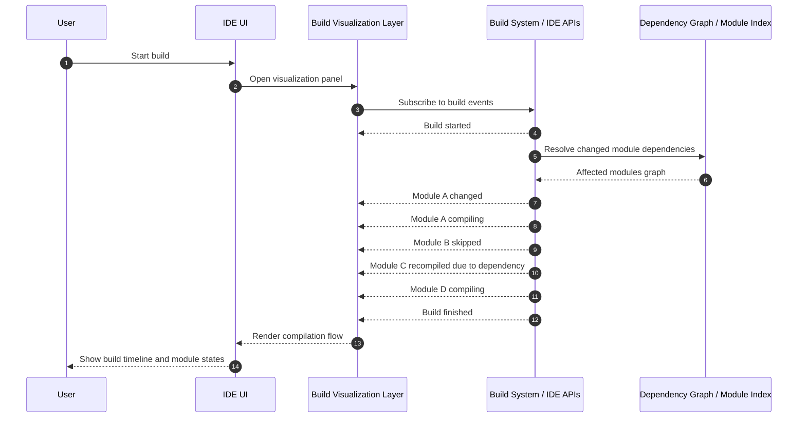
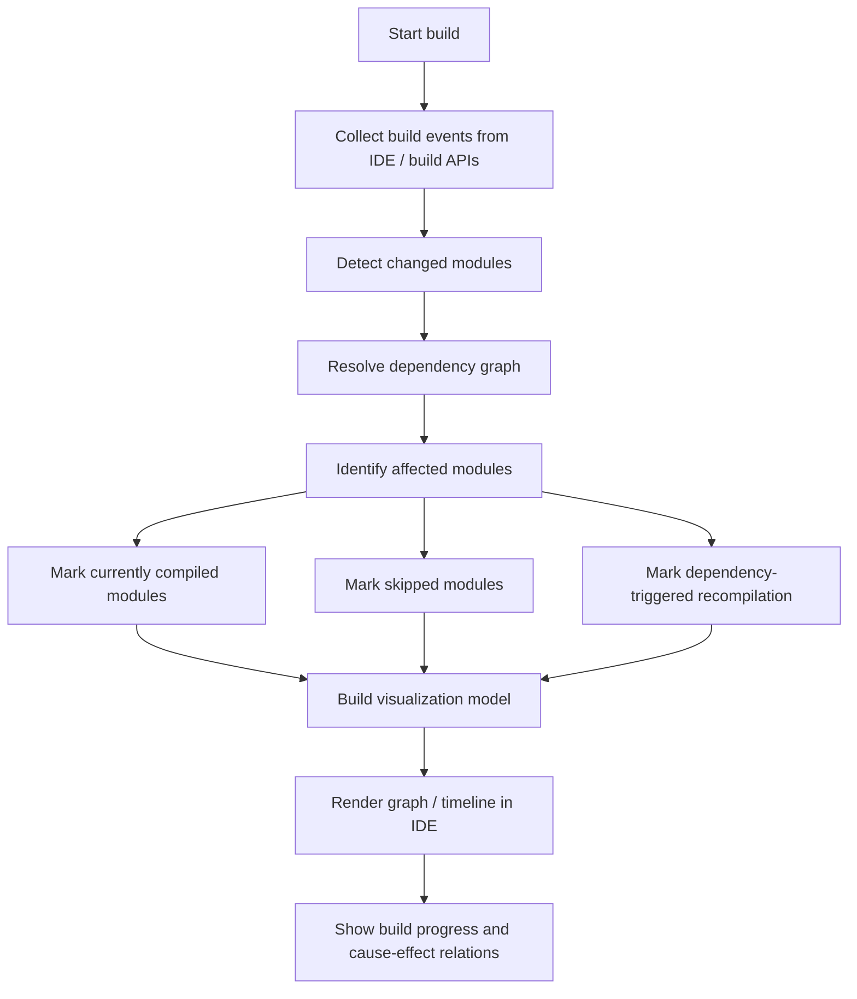
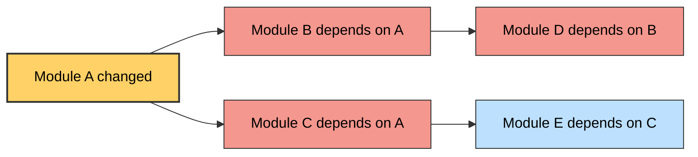
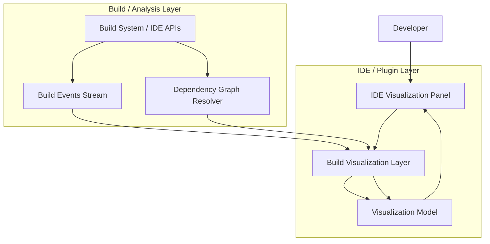

# Build-process-visualization-for-Incremental-Compilation
JetBrains Projekt

## Project Description

This project explores how the incremental build process can be made more transparent for developers. In many cases, even a small change in one module can trigger recompilation of other dependent modules, while some modules remain skipped. From a developer’s perspective, this behavior is often hidden behind text logs and it can be difficult to understand why a build takes longer than expected.

The goal of this idea is to visualize the build process and make it easier to understand which modules are being compiled, which are skipped, and how dependency relationships affect the overall compilation process.

---

## Why This Project Is Interesting to Me

I have already completed two other internship test projects related to DevOps and infrastructure. One of them involved building a Kotlin and Spring Boot service for executing shell commands on remote executors, and another was related to metrics processing.

Because of that, this project interested me as a complementary challenge focused more on developer tooling and build system transparency.

I also enjoy using visual modeling tools in my work. I frequently use UML, Mermaid, and BPMN diagrams to explain system architecture, workflows, and dependencies. This is also closely related to my master’s thesis on GitOps, where I try to visualize the methodology of GitOps adoption in a company using structured diagrams and models.

---

## Implementation Vision

I see this feature as a lightweight visualization layer integrated with the existing Kotlin/JVM build tooling.

The idea is to collect information about build events and module dependencies using available IntelliJ Platform APIs or build system APIs. This information can then be transformed into a simplified visualization model that helps developers understand:

- which modules are currently compiling  
- which modules were skipped  
- which modules were recompiled due to dependency changes  
- how a change propagates through the project

The goal is not to expose low-level build internals, but to present a clear and understandable view of the compilation flow.

---

## Diagram 1: Build Visualization Sequence

This diagram illustrates the dynamic interaction between the user, the IDE, the visualization layer, and the build system.  
It demonstrates how the visualization panel subscribes to build events and how the build system provides information about compilation progress and dependency resolution.

The main idea is that the visualization layer acts as a bridge between internal build events and the developer-facing UI.

<!-- Insert Mermaid sequence diagram here -->

---

## Diagram 2: Build Visualization Pipeline

This diagram represents the logical pipeline of the visualization system.

It shows how the system collects build events, detects changed modules, resolves dependencies, identifies affected modules, and finally generates a visualization model that can be rendered inside the IDE.

This step-by-step flow helps structure the implementation and makes the logic easier to understand.

%% Sequence diagram: shows how the build visualization could work in the IDE.
%% The IDE requests build events, receives information about changed, compiled,
%% skipped, and dependency-triggered modules, and then updates the visualization panel.

---

## Diagram 3: Dependency Propagation Example

This diagram demonstrates how a change in a single module can propagate through the dependency graph and cause recompilation of other modules.

It helps illustrate why builds sometimes take longer than expected and how dependency relationships influence the build process.

%% Flowchart: shows the main implementation idea as a pipeline.
%% First collect build data, then detect affected modules and statuses,
%% then map everything into a simple visualization model for the developer.

---

## Diagram 4: Module Build State Model

This diagram describes the possible states a module can have during the build process.

Instead of exposing many low-level states, the visualization should present a simplified model such as:

- waiting  
- compiling  
- skipped  
- recompiled  
- finished  
- failed  

This keeps the visualization readable and useful for developers.

---

## Diagram 5: Feature Architecture

This diagram shows the high-level architecture of the feature.

It illustrates how the visualization layer connects the IDE interface with the build system and dependency analysis components. The visualization model transforms internal build data into a form that can be easily displayed and understood by the developer.

---

## Technologies

Possible technologies and foundations for this implementation include:

- Kotlin
- IntelliJ Platform APIs
- Build system events
- Dependency graph analysis
- Mermaid / UML / BPMN for conceptual modeling and documentation

---

## Notes

This repository currently contains the conceptual design and explanation of the idea.  
The focus is on describing the visualization concept and the architecture of the feature rather than providing a full implementation.

The diagrams can be added later to illustrate the system design and interaction flow.

---

## Author

Pavel Dikaň
