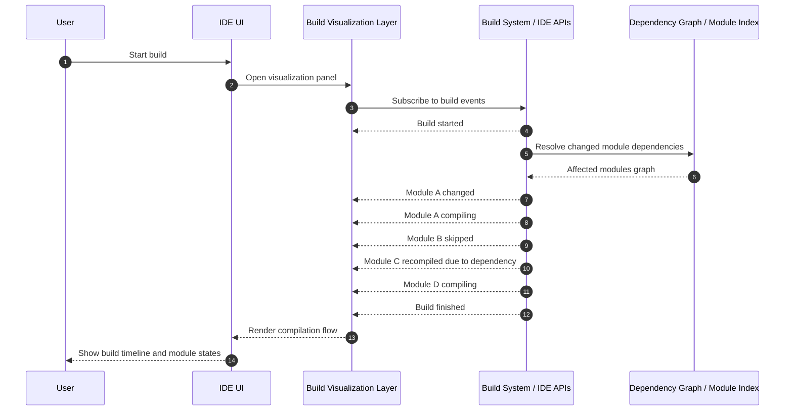
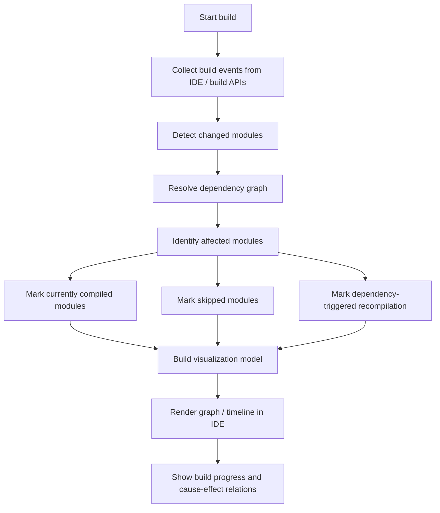
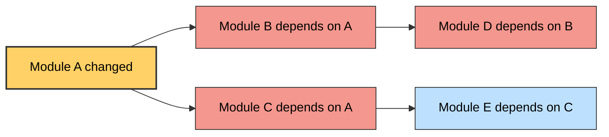
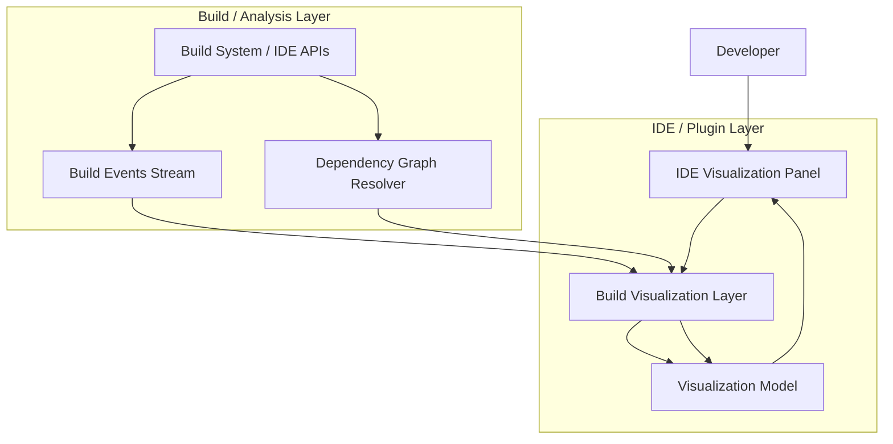

# Build Process Visualization for Incremental Compilation

This repository contains a conceptual design for the JetBrains internship task  
"Build process visualization for Incremental Compilation."

The goal of this concept is to provide a clear visualization of the incremental
build process inside the IDE. Instead of treating the build system as a black box,
developers should be able to see:

- which modules are rebuilt
- which modules are skipped
- why specific modules were triggered for recompilation
- how dependency propagation affects the build

The visualization aims to make the incremental compilation process easier to
understand, debug, and analyze.

---

# Motivation

Modern build systems perform complex incremental compilation where only affected
modules are rebuilt. While this significantly speeds up builds, the internal
decision process is often invisible to developers.

This project proposes a visualization layer that exposes build system decisions
in a clear graphical form.

The visualization would help developers answer questions like:

- Why did this module rebuild?
- Which dependency triggered the rebuild?
- Which modules were skipped?
- What was the full propagation chain?

---

# Implementation Vision

The implementation can be designed as a lightweight visualization layer that
integrates with the Kotlin/JVM build system or the IntelliJ build process.

The system would collect build events such as:

- module compilation start
- module compilation finish
- dependency resolution
- skipped modules
- incremental rebuild triggers

These events would then be transformed into a structured build graph and rendered
as an interactive visualization inside the IDE.

The main implementation steps would include:

1. Collect build events from the build system
2. Track module dependency relationships
3. Detect which modules changed
4. Determine which modules must be rebuilt
5. Build a dependency propagation graph
6. Render the build process visually

---

# Visualization Approach

The visualization can be presented as a build graph showing how the incremental
build propagates through module dependencies.

Modules would be displayed with clear states such as:

- changed
- scheduled for rebuild
- compiled
- skipped

This would allow developers to quickly understand the structure and flow of
the build process.

---

# Build Execution Flow

This section will contain a diagram illustrating the high-level build execution
pipeline and how the build system processes module changes.

# Dependency Propagation Model

This diagram illustrates how the build visualization layer processes
incremental compilation events.

The system collects build events from the IDE or build system APIs,
resolves module dependencies, and determines which modules are
compiled, skipped, or recompiled due to dependency changes.

The resulting data is then transformed into a visualization model
that can be rendered inside the IDE.

# Dependency propagation diagram

Key stages in the process:

• **Collect build events** — listen to compilation events provided by the IDE or build system.

• **Detect changed modules** — identify modules that were modified or affected by code changes.

• **Resolve dependency graph** — determine which modules depend on the changed modules.

• **Identify affected modules** — determine which modules must be rebuilt and which can be skipped.

• **Build visualization model** — transform build events and dependency information into a graph that can be displayed in the IDE.

---

# Module Build State Model

Modules in the build process can transition through several states during
incremental compilation.

Typical states include:

- changed
- queued for compilation
- compiling
- compiled
- skipped

# Module dependency propagation

---

# System Architecture

This section will illustrate how the visualization layer integrates with the
build system and the IDE.

The architecture may include components such as:

- build event collector
- dependency analyzer
- build graph generator
- visualization renderer
- 
# System architecture diagram 

---

# Technologies

Possible technologies that could be used for the implementation:

- Kotlin
- IntelliJ Platform APIs
- Build system event listeners
- Dependency graph analysis
- Visualization tools (Mermaid or similar)

---

# Notes

This repository currently contains a conceptual design and visualization ideas
for the internship task.

The diagrams will demonstrate how incremental build information could be
collected, processed, and visualized in a developer-friendly way.

---

# Author

Pavel Dikan
